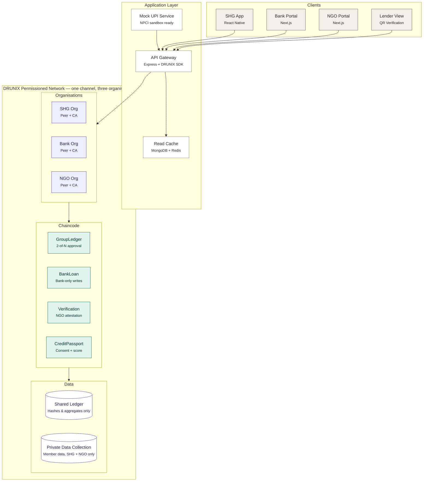
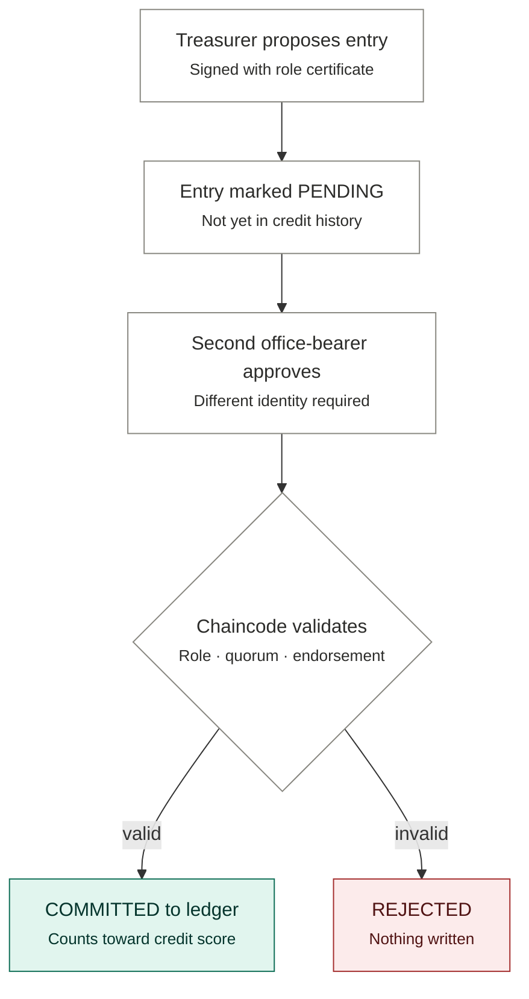

# Lekha

**Every record witnessed. Every loan earned.**

Sakshi is a shared, tamper-evident financial ledger for Self-Help Groups (SHGs), built on the **DRUNIX** permissioned network for the **Citi Ada Lovelace Hackathon**.

It puts the SHG, the bank and a facilitating NGO on one shared ledger where no single party can rewrite the truth, and turns a group's repayment discipline into a **verifiable credit history** that any lender can trust.

---

## The Problem

SHGs, mostly groups of 10–20 rural women, save together and lend to each other, and they tend to repay reliably. But:

- Their books are often patchy and held by **one office-bearer**, which leaves room for mismanagement.
- Banks size SHG loans partly on past credit history, yet they have to rely on **records supplied by the group itself**.
- Digitising registers doesn't help much if any single person can still edit the entries.

**SHGs have discipline. What they lack is proof.**

## The Solution

A shared ledger where each party controls only its own part of the truth:

| Party | What it controls |
|---|---|
| **SHG / Federation** | Savings, internal loans and repayments, with two office-bearer approval |
| **Bank** | Loan disbursal and repayment state (bank-only) |
| **NGO / Facilitator** | Group verification and grading |

The group can then share a **Credit Passport**, a verifiable repayment summary, with any lender, with its consent.

---

## Key Features

- **Two-person rule:** Every group entry needs approval from two distinct office-bearers. A lone treasurer cannot add or alter records.
- **Append-only books:** There is no edit or delete. Corrections are approved reversal entries, so the full history stays visible.
- **Bank-owned loan state:** Loan records can only be changed by the bank, enforced through key-level endorsement policies.
- **NGO attestation:** Signed verification and grading based on the Panchasutra criteria.
- **Credit Passport:** Consent-based, time-limited and revocable sharing, verified by QR against the ledger.
- **Transparent score:** A simple formula instead of black-box AI. Every number traces back to ledger entries.
- **Simulated UPI:** EMI repayments flow through a mock UPI service that can be swapped for NPCI sandbox APIs.
- **Privacy first:** Only hashes and aggregates go on-chain, and all data is synthetic.

---

## Architecture

### System Overview



Every request goes through the **API gateway**, which submits transactions to DRUNIX using the caller's role-based identity. UPI payment events feed into the gateway, and the **read cache** only serves fast dashboard queries. The ledger remains the single source of truth. Each organisation runs its own peer, so no single party controls the infrastructure.

### Entry Approval Flow



A lone treasurer, a self-approval, or any attempt to write to a bank-owned record ends in **REJECTED**, so nothing reaches the ledger. Bank writes follow the same path, except that the check is that the Bank organisation endorsed the change.

### Chaincode Contracts

| Contract | Responsibility | Who can write |
|---|---|---|
| `GroupLedger` | Contributions, internal loans and repayments, with propose/approve | SHG office-bearers (2 distinct approvals) |
| `BankLoan` | Loan disbursal, repayment and overdue status | Bank org only (key-level endorsement) |
| `Verification` | Group verification and Panchasutra grading | NGO org only |
| `CreditPassport` | Consent grant and revoke, score, passport hash anchoring | SHG (with 2 approvals) for consent; computed from ledger |

### Credit Score

```
Repayment Score = 0.5 × on-time bank repayment %
                + 0.3 × on-time internal loan repayment %
                + 0.2 × savings regularity (months saved / total months)
```

The score maps to loan eligibility bands based on SHG-bank linkage norms. Every component traces back to committed ledger entries.

---

## Tech Stack

| Layer | Technology |
|---|---|
| Blockchain | DRUNIX, Go / TypeScript chaincode |
| Backend | Node.js, Express, MongoDB, Redis |
| Frontend | React Native, Next.js, React |
| Payments | Simulated UPI (NPCI API ready) |
| Security | SHA-256 hashing, role-based X.509 identities, TLS |
| DevOps | Docker, Docker Compose, GitHub Actions |

---

## Project Structure

```
sakshi/
├── network/            # DRUNIX network config, orgs, CAs, channel setup
├── chaincode/
│   ├── group-ledger/
│   ├── bank-loan/
│   ├── verification/
│   └── credit-passport/
├── api/                # Express API gateway
├── upi-mock/           # Simulated UPI collect service
├── apps/
│   ├── shg-mobile/     # React Native app
│   └── dashboard/      # Next.js bank + NGO dashboards
├── scripts/            # Seed synthetic data, demo scenarios
├── docker-compose.yml
└── README.md
```

---

## Getting Started

### Prerequisites

- Docker and Docker Compose
- Node.js 18+
- Go 1.21+ (if using Go chaincode)
- Access to the DRUNIX test network

### Setup

```bash
git clone https://github.com/<your-org>/sakshi.git
cd sakshi

# start network, chaincode and services
docker compose up -d

# seed synthetic SHG data
npm run seed

# run the dashboards
cd apps/dashboard && npm install && npm run dev
```

### Run Tests

```bash
npm run test:chaincode   # approval rules and endorsement policy tests
npm run test:api
```

---

## Demo Scenarios

1. **Tamper attempt:** The treasurer tries to add a fake repayment alone. It stays pending and cannot be committed.
2. **Unauthorised overwrite:** The treasurer tries to edit a bank loan record. It fails with an endorsement policy error.
3. **Honest flow:** The treasurer proposes and the secretary approves. The entry commits.
4. **Repayment:** A simulated UPI EMI payment is recorded on-chain by the bank.
5. **Credit Passport:** The group grants consent, and the bank officer scans the QR code, sees the verified history and watches the loan eligibility band change.

---

## Privacy

- No personal details on the shared ledger. Members are identified by hashed IDs.
- Member-level data lives in private data collections visible only to the SHG and the NGO.
- Lender access requires explicit, time-limited, revocable consent.
- This prototype uses **synthetic data only**.

---

## Roadmap

- [ ] Three-org DRUNIX network with role-based identities
- [ ] GroupLedger and BankLoan chaincode
- [ ] API gateway and SHG mobile app
- [ ] Verification, Credit Passport and scoring
- [ ] Bank and NGO dashboards
- [ ] NPCI sandbox UPI integration
- [ ] Vernacular and voice support for the SHG app
- [ ] Pilot with a bank branch, an NGO and an SHG federation

---

## Team

| Name | Role |
|---|---|
| | |
| | |
| | |

---

## License

MIT
